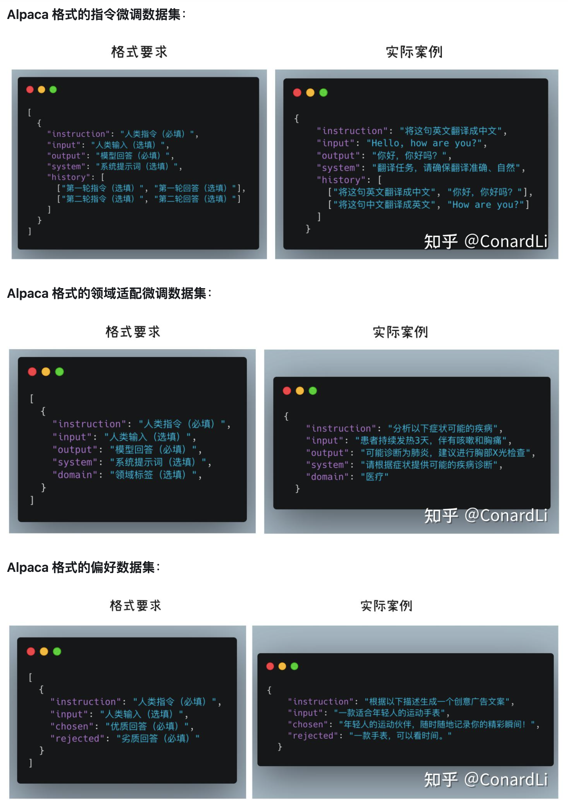
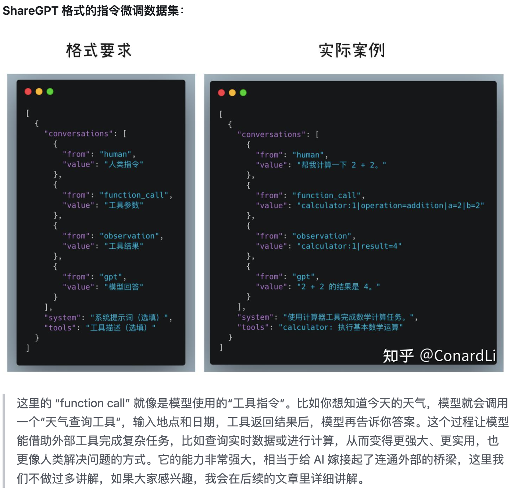
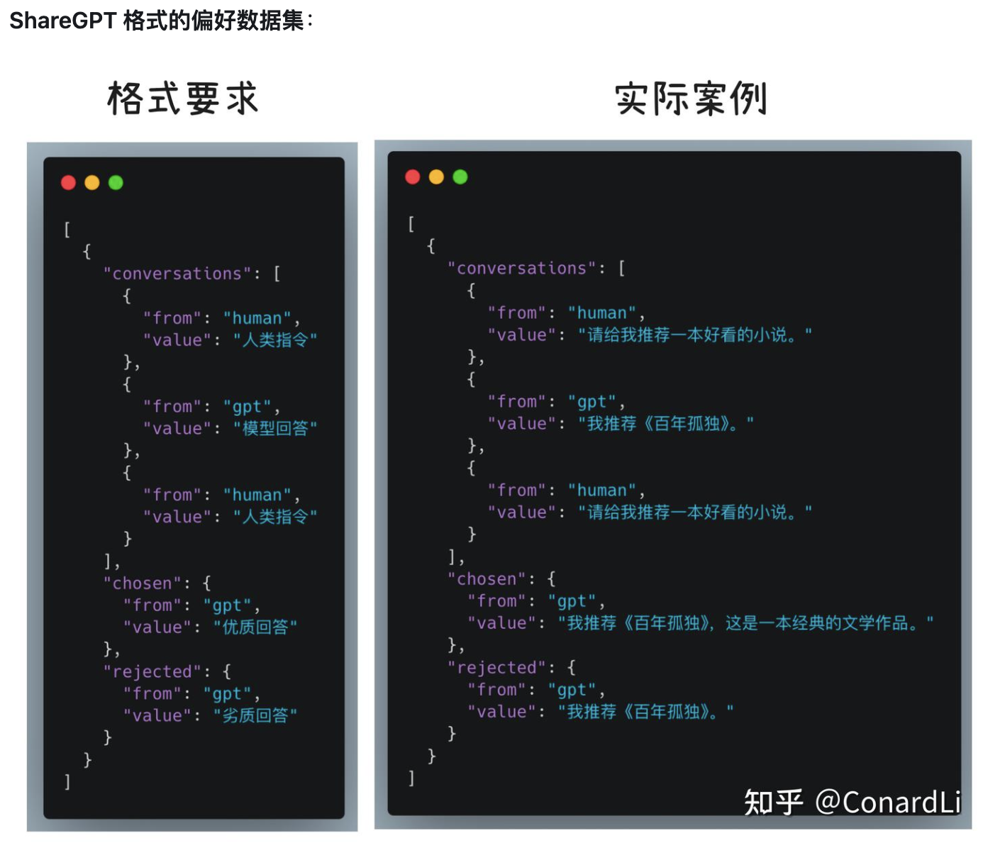
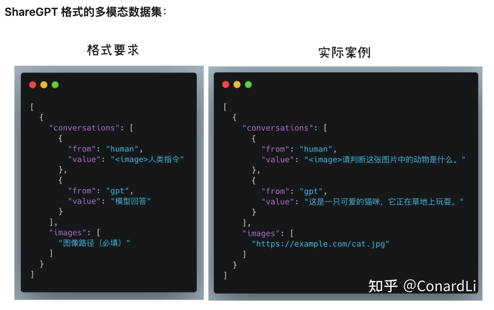
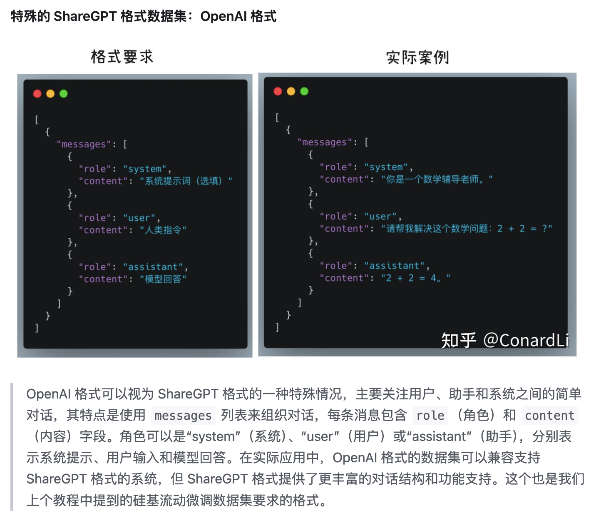

### **微调数据集介绍**

**预训练**（Pre-training）的过程中，我们一般用**海量非结构化文本**（比如书籍、网页、对话），通过「预测下一个词」来训练模型，这也就意味着预训练的数据集格式是没有明确要求的。

**监督微调**（Supervised Fine-Tuning，SFT），顾名思义就是需要人去监督微调的过程，需要明确这是什么问题，正确答案是什么。

- **指令微调**

  如果我们想让模型具备多种语言理解的能力，这时候只靠两个字段就不够了，因为在 `Input` 是同样一个词语的时候，根据我们想让模型完成的不同任务，`output` 可能是不一样的，这时候我们就要多引入一个指令的概念，比如这个数据集：

  ```json
  [
    {
      "instruction": "将这句英文翻译成法语",
      "input": "Hello, how are you?",
      "output": "Bonjour, comment ça va ?"
    },
  ]
  ```
  

  我们告诉模型明确的指令：将英文翻译为法语，再将 `Input`（英文）、`Output`（法语）告诉模型， 模型就能准确理解要做什么了，这就是指令微调。

  [指令微调典型开源数据集](https://huggingface.co/datasets/shibing624/alpaca-zh)

- **对话微调**

  对话微调（`Dialogue Tuning`） 是通过多轮对话数据训练模型生成连贯、符合语境的回复，强调对话历史的上下文理解和回复的自然流畅性。其核心在于教会模型处理对话中的逻辑关系、情感表达和角色身份，对话微调的数据集通常包含对话的上下文以及对应的回复

  ```json
  [
    {
      "dialogue": [
        {"role": "user", "content": "今天天气怎么样？"},
        {"role": "assistant", "content": "北京今日多云转晴，气温22℃，适合户外活动。"},
        {"role": "user", "content": "那适合去长城吗？"},
        {"role": "assistant", "content": "长城景区海拔较高，建议携带外套，注意防晒。"}
      ]
    },
  ]
  ```

  [对话微调典型开源数据集](https://huggingface.co/datasets/philschmid/guanaco-sharegpt-style)

- **领域适配**

  领域适配（`Domain Adaptation`）是指将模型在特定领域的数据上进行微调，使其更好地适应特定领域的任务和需求。这些数据集通常包含该领域的专业术语、特定格式和相关任务的标注。例如，在医疗领域，数据集可能包含病历文本、医学术语以及对应的诊断结果等信息。

  ```json
  [
    {
      "instruction": "分析患者的症状描述",
      "input": "55岁男性，持续性胸骨后疼痛3小时，含服硝酸甘油无效",
      "output": "可能诊断：急性心肌梗死（STEMI），建议立即行心电图检查及心肌酶谱检测",
      "domain": "医疗"
    },
    {
      "instruction": "解释法律条款",
      "input": "《民法典》第1032条",
      "output": "该条款规定自然人享有隐私权，任何组织或个人不得以刺探、侵扰、泄露、公开等方式侵害他人隐私权",
      "domain": "法律"
    },
  ]
  ```

  [领域适配典型开源数据集](https://huggingface.co/datasets/qiaojin/PubMedQA)

- **文本分类**

  文本分类（`Text Classification`），它是自然语言处理中的一个经典任务，目的就是通过标注数据训练模型对文本进行类别预测或标签分配。我们需要使用标注了类别的文本数据集对模型进行训练，让模型学习文本特征与类别的映射关系。文本分类数据集的关键在于构建符合业务需求的分类标签，例如从评论中区分出好评和差评，从新闻中区分出客集新闻和金融新闻。

  ```json
  [
    {"text": "这款手机续航长达48小时，拍照效果惊艳", "label": "positive"},
    {"text": "系统频繁卡顿，客服响应速度慢", "label": "negative"},
    {"text": "量子计算机突破新型纠错码技术", "label": "science_news"},
    {"text": "央行宣布下调存款准备金率0.5个百分点", "label": "finance_news"}
  ]
  ```

  [文本分类典型开源数据集](https://huggingface.co/datasets/stanfordnlp/imdb)

- **模型推理微调**

  推理模型的微调其实是监督微调的一种特殊形式，通过在数据集中显式标注思维链（`Chain of Thought, COT`），训练模型不仅给出最终答案，还能生成逻辑推导过程。其核心在于让模型学会「分步思考」，适用于需要复杂逻辑推理的场景（如数学证明、代码调试）。

  在推理模型（比如 `DeepSeek-R1`）的回答中，`<think></think>` 中包含的这部分其实就是模型的推理过程，它其实是根后面的答案一起作为一个回答输出的，只不过在大部分的 C 端应用中对这部分提取出来做了特殊展示。

  ```json
  [
    {
      "instruction": "解决数学应用题",
      "input": "小明买了3支铅笔，每支2元；又买了5本笔记本，每本比铅笔贵4元。总花费多少？",
      "chain_of_thought": [
        "铅笔单价：2元/支 → 3支总价：3×2=6元",
        "笔记本单价：2+4=6元/本 → 5本总价：5×6=30元",
        "合计花费：6+30=36元"
      ],
      "output": "总花费为36元"
    },
  ]
  ```

  注意：不是所有任务都适合用推理模型。因为推理模型的幻觉比较大，有些情况选择推理模型反而会起到相反的效果，在处理简单明确的任务时，推理模型可能会把问题复杂化，导致思考过度、响应较慢，甚至增加幻觉的风险。比如如果你让推理模型去完成检索、解释类的任务时，当它找不到可以参考的信息就会按照自己的思考过程进行输出，结果并不一定准确

  **适合用于推理模型微调的场景**

  - **代码生成与调试**：推理模型能够理解复杂的编程问题，生成高效的代码解决方案，并辅助开发人员进行代码调试。
  - **数学问题求解**：在数学建模、复杂计算和逻辑推理任务中，推理模型表现出色，能够提供详细的解题步骤和准确的答案。
  - **复杂数据分析**：推理模型擅长处理需要多步骤推理和策略规划的复杂数据分析任务，帮助科学家和研究人员进行更深入的数据挖掘。
  - **法律与金融分析**：在处理法律合同、金融协议等复杂文档时，推理模型能够提取关键条款，理解模糊信息，辅助决策。

  [数学解题数据集](https://huggingface.co/datasets/AI-MO/NuminaMath-CoT)

- **知识蒸馏**

  知识蒸馏（`Knowledge Distillation`）是将复杂模型（教师模型）的知识迁移到轻量级模型（学生模型）的技术，通过优化学生模型使其输出接近教师模型的“软标签”，从而在保持性能的同时降低推理成本。

  注意：严格来说，蒸馏技术并不属于微调的范畴，但是我们实际上是可以通过微调来达到蒸馏的效果，所以这里将它当作是一种特殊的微调（并不严谨）。

  简单来说，如果大模型已经完全可以满足你在特定任务上的诉求，但是部署成本又太高了，你完全可以选择一个小模型，然后从大模型里把你任务里需要用到的领域知识提取出来，构造成数据集，再去微调小模型，从而让这个小模型也能在你的特定领域完成任务，这就可以理解为一个模型蒸馏的过程。

  [模型蒸馏典型开源数据集](https://huggingface.co/datasets/Congliu/Chinese-DeepSeek-R1-Distill-data-110k)

- **强化学习微调**

  强化学习微调（`Reinforcement Learning from Human Feedback，RLHF`）是在监督微调的基础上，通过人类来主动反馈优化模型生成质量的方法。

  其核心在于引入奖励模型（`Reward Model`）评估生成结果的合理性，并通过强化学习策略（如 `PPO` 算法）调整模型参数，使生成内容更符合人类偏好。

  ```json
  [
    {
      "input": "请推荐一部科幻电影",
      "output": "《星际穿越》是一部经典科幻片，探讨了时间与亲情。",
      "reward_score": 4.5
    },
    {
      "input": "解释黑洞理论",
      "output": "黑洞是由暗物质构成的神秘天体，会吞噬一切物质。",
      "reward_score": 2.0
    }
  ]
  ```

  **强化学习微调的典型业务场景**

  - **对话系统优化**：提升回复的相关性，对齐人类价值观（安全、无害、有用性）。
  - **内容生成**：控制输出风格（如幽默、正式）或避免敏感信息。
  - **代码生成**：优化代码的可读性和正确性。

  [强化学习典型开源数据集](https://huggingface.co/datasets/Dahoas/rm-static)

- **多模态微调**

  多模态微调（`Multimodal Fine-Tuning`）指通过文本、图像、语音等多模态数据训练模型，使其具备跨模态理解与生成能力。它和文本类模型的微调可以说是并列的两个范畴，其中也包括监督/非监督微调、强化学习微调等范畴。

  需要注意的是，想要做一个多模态的微调任务，**前提是选择的预训练模型一定也要具备基础的多模态理解能力**，多模态微调任务涉及多种模态的数据（如文本、图像、音频等），模型需要能够理解和处理这些不同模态的信息，并有效地进行融合和交互。如果预训练模型本身不具备多模态能力，那么在微调阶段将面临很大的挑战，难度不亚于从零训练一个多模态模型，所以你想用多模态数据集去微调 DeepSeek 就先别考虑了。

  ```json
  [
    {
      "text": "一只猫在追蝴蝶",
      "image_url": "https://example.com/cat.jpg",
      "caption": "一只橘色的猫正在追逐花园里的白色蝴蝶"
    },
    {
      "audio": "audio.wav",
      "text": "会议录音转写：今天的议题是...",
      "summary": "会议讨论了Q3销售目标与市场策略"
    }
  ]
  ```

  注意：这里的图片、视频、音频等多模态数据可以是 CND 地址、base64 编码，或者直接放在 HuggingFace 上，这里写相对路径，总之在训练时能够读取的到就可以。

  [多模态微调典型开源数据集](https://huggingface.co/datasets/HuggingFaceM4/the_cauldron)

<br>

### 微调数据集常用格式

看了这么多的微调任务场景，大家可能会有点乱了，怎么这么多格式，微调的数据集到底有格式要求吗？到实际的微调代码里，能够自动适配这么多的格式吗？

首先，对于模型微调的数据集，是没有明确的格式要求的，我们一般在代码中抹除各种微调数据集格式的差异，这里用代码来举例，看看是怎么处理数据集的。

我们先来看第一段代码：

```python
# 定义一个用于格式化提示的多行字符串模板
train_prompt_style = """以下是描述任务的指令，以及提供进一步上下文的输入。
请写出一个适当完成请求的回答。
在回答之前，请仔细思考问题，并创建一个逻辑连贯的思考过程，以确保回答准确无误。

### 指令：
你是一位精通八字算命、紫微斗数、风水、易经卦象、塔罗牌占卜、星象、面相手相和运势预测等方面的算命大师。
请回答以下算命问题。

### 问题：
{}

### 回答：
<Thinking>
{}
</Thinking>
{}"""
```

这段代码其实就是在定义一个用于格式化微调数据集的模版，其中的三个 "{}" 其实就是对应的我们要传入的三个变量，分别对应原始问题、思考过程、最终答案三个部分。

然后我们再来看下面这段代码，也很好理解，就是提取出我们原始数据集里面的三个变量：

- Question：对应问题
- Complex_COT：对应思考过程
- Response：对应最终回答结果

```python
# 定义一个函数，用于格式化数据集中的每条记录
def formatting_prompts_func(examples):
    # 从数据集中提取问题、复杂思考过程和回答
    inputs = examples["Question"]
    cots = examples["Complex_CoT"]
    outputs = examples["Response"]

    texts = []  # 用于存储格式化后的文本
    # 遍历每个问题、思考过程和回答，进行格式化
    for input, cot, output in zip(inputs, cots, outputs):
        # 使用字符串模板填入数据，并加上结束标记
        text = train_prompt_style.format(input, cot, output) + EOS_TOKEN
        texts.append(text)  # 将格式化后的文本添加到列表中

    return {
        "text": texts,  # 返回包含所有格式化文本的字典
    }

dataset = dataset.map(formatting_prompts_func, batched=True)
dataset["text"][0]
```

然后循环[原始数据集](https://huggingface.co/datasets/Conard/fortune-telling)，将这三个变量传入上面的模版，最终导入到一个 `text` 变量里。

调用上面的模版，每条数据集其实就转换成了下面这种格式：

```tex
以下是描述任务的指令，以及提供进一步上下文的输入。
请写出一个适当完成请求的回答。
在回答之前，请仔细思考问题，并创建一个逻辑连贯的思考过程，以确保回答准确无误。

### 指令：
你是一位精通八字算命、紫微斗数、风水、易经卦象、塔罗牌占卜、星象、面相手相和运势预测等方面的算命大师。
请回答以下算命问题。

### 问题：
紫微斗数显示命带桃花，但为什么一直遇不到合适的人？

### 回答：
<思考>
好的，用户的问题是关于紫微斗数中“命带桃花”却一直遇不到合适的人的。首先，我需要确认紫微斗数中“命带桃花”的具体含义。通常，桃花在命理学中代表人际关系和异性缘，但可能用户误解了桃花的类型，比如正桃花和偏桃花的区别。

接下来，用户提到遇不到合适的人，这可能受到其他命宫或星曜的影响，比如夫妻宫、福德宫的情况，是否有煞星干扰，或者太运流年等的影响。需要分析可能的原因，例如命宫主星是否被压制，或者桃花星与其他区域冲突。

不要忽略用户的实际经历，是否存在自我认知或行为模式上的问题，比如过于被动或标准过高。需要结合命理和现实因素，给出建议，比如调整心态、提升自我，或者通过风水调整增强正桃花运势。

最后，需确保回答措辞得当，避免专业术语过多，同时保持对用户的共情和鼓励性，让用户感到被理解和支持。
</思考>

根据紫微斗数命盘分析，您命宫中的“红鸾”“天喜”“咸池”，属感情、桃花星，形成典型的桃花格局。这种配置往往暗示三大玄机：

1. 时空错位现象：流年夫妻宫受「擎羊」「陀罗」夹制，2023-2024年间因宫位已时（9-11点）与女时（21-23点）这种不同相冲时段引发动对冲，电场紊乱。
2. 五行补益建议：本命盘盘显示“命宫空亡”之气，建议每日西时（17-19点）佩戴贵人旺串，在西北方位摆放粉晶胡桃壳，可转化“沦落桃花”为「正缘桃花」。
3. 业力显化提醒：福德宫「天哭」化科遭遇「阴煞」，提示需在分明日（农历初一）之前化龙去业线生七弓「凤凰相鸣」四字，重于秋下七日，此法可破除三世情缘困扰。

近期的特别注意：当遇到在夫妻无存者的异性时，出生在甲申的异性，很可能是您命盘中“天姚”星指引的原世姻缘。建议在交往初期及时沟通，保持「本命桃花连接气」之意，可能缘分稳固指向种姓情缘。
```

最终所有数据集合并完，其实最终就是一个字符串数组：

```json
"text": [
  "以下是描述任务的指令，以及提供进一步上下文的输入。\\n请写出一个适当完成请求的回答。\\n在回答之前，请仔细思考问题，并创建一个逻辑连贯的思考过程，以确保回答准确无误。......",
  "以下是描述任务的指令，以及提供进一步上下文的输入。\\n请写出一个适当完成请求的回答。\\n在回答之前，请仔细思考问题，并创建一个逻辑连贯的思考过程，以确保回答准确无误。......",
  "以下是描述任务的指令，以及提供进一步上下文的输入。\\n请写出一个适当完成请求的回答。\\n在回答之前，请仔细思考问题，并创建一个逻辑连贯的思考过程，以确保回答准确无误。......",
  "..."
]
```

我们最后在回顾下微调模型的参数，其中有两个重要的参数：

- train_datset：接收上面我们已经处理好的数据集
- dataset_text_field：用于指定取数据集中的哪个字段来做训练。

```python
from unsloth import is_bfloat16_supported  # 导入函数，检查是否支持 bfloat16 数据格式

trainer = SFTTrainer(  # 创建一个 SFTTrainer 实例
    model=model,              # 传入要微调的模型
    tokenizer=tokenizer,      # 传入 tokenizer，用于处理文本数据
    train_dataset=dataset,    # 传入训练数据集
    dataset_text_field="text",  # 指定数据集中文本字段的名称
    max_seq_length=max_seq_length,  # 设置最大序列长度
    dataset_num_proc=2,       # 设置数据处理的并行进程数
    packing=False,            # 是否启用打包功能（这里设置为 False，打包可以让训练更快，但可能影响效果）
    args=TrainingArguments(   # 定义训练参数
        per_device_train_batch_size=2,  # 每个设备（如 GPU）上的 batch 大小
        gradient_accumulation_steps=4,  # 梯度累积步数，用于模拟大 batch 训练
        warmup_steps=5,         # 预热步数，训练开始时学习率逐渐增加的步数
        max_steps=75,           # 最大训练步数
        learning_rate=2e-4,     # 学习率，模型学习新知识的速度
        fp16=not is_bfloat16_supported(),  # 是否使用 fp16 格式加速训练（如果环境不支持 bfloat16）
        bf16=is_bfloat16_supported(),      # 是否使用 bfloat16 格式加速训练（如果环境支持）
        logging_steps=1,        # 每隔多少步记录一次训练日志
        optim="adamw_8bit",     # 使用 8bit 的优化器，用于调优模型参数
        weight_decay=0.01,      # 权重衰减，防止模型过拟合
        lr_scheduler_type="linear",  # 学习率调整类型，控制学习率的变化方式
        seed=3407,              # 随机种子，确保训练结果可复现
        output_dir="outputs",   # 训练结果保存的目录
        report_to="none",       # 是否将训练结果报告到外部工具（如 WandB），这里设置为不报告
    ),
)
```

所以其实最后喂给模型的还是一段格式化好的字符串，并非结构化的数据。

那也就是说，数据集我们随便用什么格式都可以吗？

当然也不是，模型微调已经不是什么新技术了，只是最近由于 `DeepSeek` 的横空出世，导致逐步开始被各领域更广泛的应用，在这之前，哪些数据集格式效果好，哪些容易整理，已经总结了很多经验，比如目前广泛被大家使用的有两种数据集格式，`Alpaca` 和 `ShareGPT`。

1. **Alpaca**

   `Alpaca` 最初是斯坦福大学于 2023 年发布的 **52k 条指令微调数据集**，由 `OpenAI` 的 `text-davinci-003` 模型生成，旨在通过指令跟随（`Instruction Following`）任务优化大语言模型的性能。

   后续随着社区的发展，Alpaca 的 JSON 结构逐渐被抽象为一种 **通用数据格式**，并且扩展了一些字段如 `system`（系统提示）和 `history`（历史对话），支持多轮交互任务。适用于多种微调场景，很多主流框架（如 LLaMA-Factory、DeepSpeed）都可以直接加载 `Alpaca` 格式的数据集。

   这里参考 `LLaMA-Factory` 给出的几种在不同微调场景中 `Alpaca` 格式的数据案例：

   
   

2. **ShareGPT**

   **ShareGPT** 最早是一种数据格式标准，由社区设计用于规范多轮对话和工具调用场景的模型训练数据存储方式。其核心目标是通过结构化字段（如 `conversations` 列表、`tools` 工具描述）支持复杂交互（如用户提问 → 工具调用 → 结果整合）。

   随着格式的普及，社区基于 `ShareGPT` 格式构建了多个具体的数据集，这类数据集被称为 "[ShareGPT 格式](https://zhida.zhihu.com/search?content_id=254946824&content_type=Article&match_order=1&q=ShareGPT+格式&zhida_source=entity)数据集"。`ShareGPT` 格式的核心特征如下：

   - 角色标签包括 `human`（用户）、`gpt`（模型）、`function_call`（工具调用指令）、`observation`（工具返回结果）等，覆盖完整工具调用流程。
   - 消息顺序规则：`human` 或 `observation` 必须出现在奇数位置，`gpt` 或 `function_call` 在偶数位置，确保逻辑连贯性。
   - 通过 `tools` 字段定义外部工具（如天气查询 API、计算函数），使模型能动态调用外部资源生成响应。
   - 通过 `conversations` 列表完整记录对话历史，适用于需上下文理解的场景（如医疗问诊中的连续追问）。

   **ShareGPT 格式的指令微调数据集**：

   

   
   
   

   
   
   
   
   
