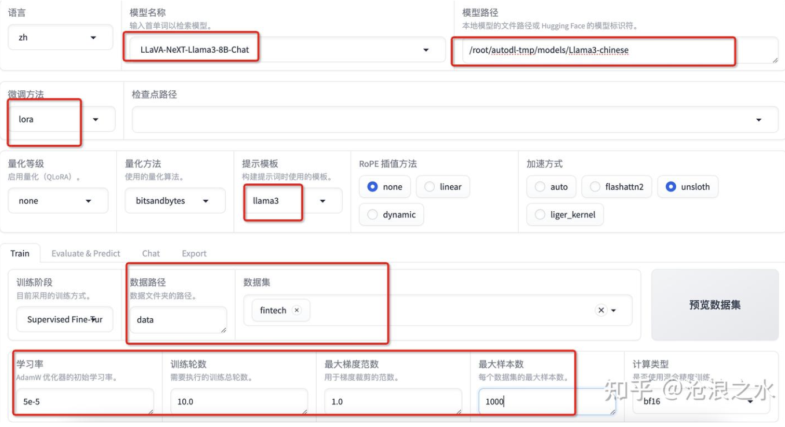
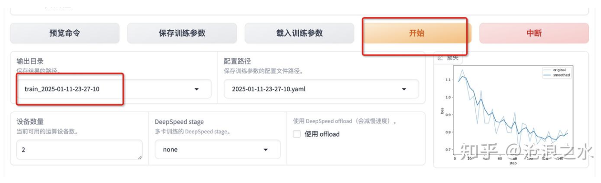
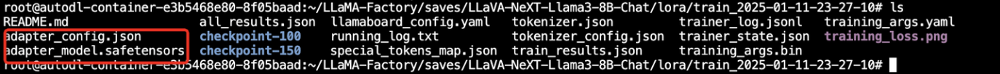
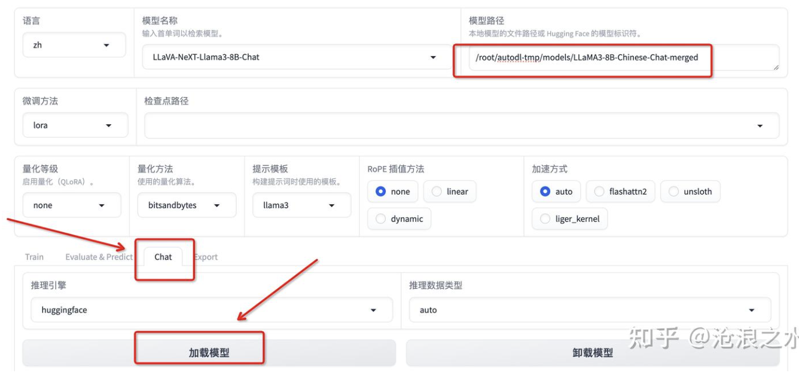
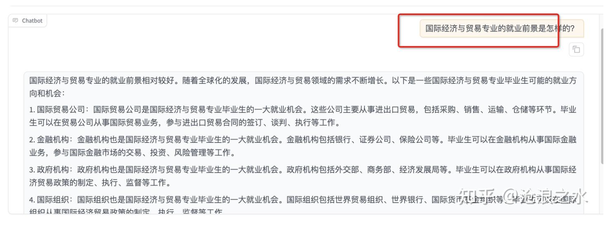
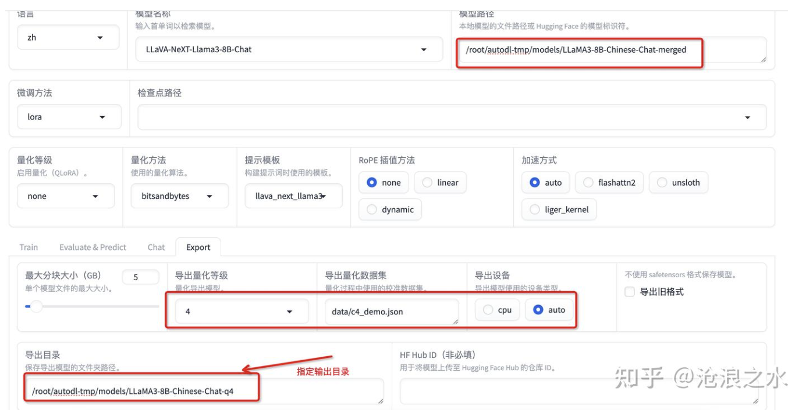
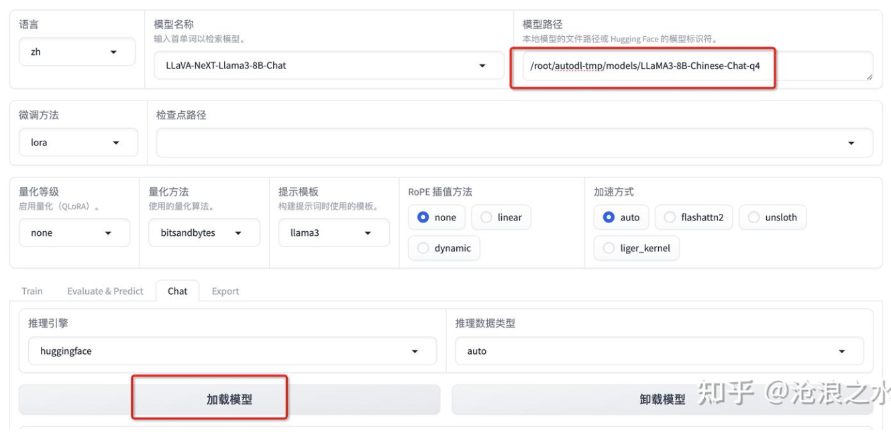
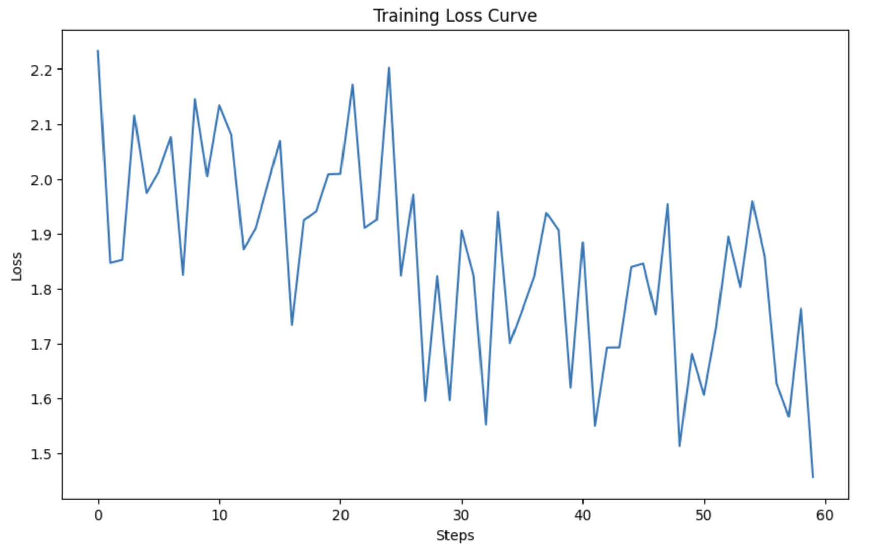
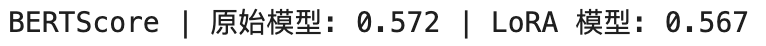

### 微调框架介绍

1. **Llama Factory**

    LLaMA-Factory作为一个开源的微调框架，通过其用户友好的界面和丰富的功能特性，为开发者提供了一个简便、高效的工具，以便在现有的预训练模型基础上，快速适应特定任务需求，提升模型表现。

    [官网安装教程](https://llamafactory.readthedocs.io/zh-cn/latest/getting_started/installation.html#)

    **1.1 LLaMA-Factory配置**

    **安装LLaMA-Factory**

    ```bash
    git clone --depth 1 https://github.com/hiyouga/LLaMA-Factory.git
    cd LLaMA-Factory

    conda create -n llama-factory python=3.10
    conda activate llama-factory

    pip install -e ".[torch,metrics]"
    ```

    **LLaMA-Factory校验**

    ```bash
    llamafactory-cli version
    ```

    **启动LLaMA-Factory WebUI**

    ```bash
    CUDA_VISIBLE_DEVICES=0 GRADIO_SHARE=1 GRADIO_SERVER_PORT=7860 llamafactory-cli webui
    ```

    **打开WebUI**

    ```bash
    localhost:7860
    ```

    **1.2 下载模型**

    **安装huggingface模型下载工具**

    ```bash
    export HF_ENDPOINT=https://hf-mirror.com

    # 安装模型下载工具
    pip install -U huggingface_hub
    pip install huggingface-cli
    ```

    **模型下载**

    选择[llama3模型](https://huggingface.co/shenzhi-wang/Llama3-8B-Chinese-Chat)做为基础模型

    ```bash
    # 下载到本地
    huggingface-cli download --resume-download shenzhi-wang/Llama3-8B-Chinese-Chat --local-dir /root/autodl-tmp/models/Llama3-chinese
    ```


    **1.3 数据集下载**

    选择关于经济学对话信息的[数据集](https://github.com/echonoshy/cgft-llm/blob/master/llama-factory/data/fintech.json)，将文件放置到`LLaMA-Factory/data`目录下。

    ```bash
    git clone https://github.com/echonoshy/cgft-llm.git

    cp cgft-llm/data/fintech.json ~/LLaMA-Factory/data
    ```

    **修改数据注册文件**

    修改文件：`LLaMA-Factory/data/dataset_info.json`，目的是为了让LLaMA-Factory识别到我们的数据集文件。注：其中columns指定了数据集的列。

    ```
    "fintech": {
    "file_name": "fintech.json",
    "columns": {
        "prompt": "instruction",
        "query": "input",
        "response": "output",
        "history": "history"
    }
    }
    ```
    

    **1.4 微调模型**

    **配置微调参数**

    使用LoRA进行模型微调

    - **设置参数**

    

    - **设置输出并开始**

    

    完成执行后输出模型

    

    **合并模型**

    将 base model 与训练好的 LoRA Adapter 合并成一个新的模型

    - **合并模型配置**

    文件：`cust/merge_llama3_lora_sft.yaml`

    ```yaml
    ### Note: DO NOT use quantized model or quantization_bit when merging lora adapters
    
    ### model
    model_name_or_path: /root/autodl-tmp/models/Llama3-chinese
    adapter_name_or_path: /root/LLaMA-Factory/saves/LLaVA-NeXT-Llama3-8B-Chat/lora/train_2025-01-11-23-27-10
    template: llama3
    finetuning_type: lora
    
    ### export
    export_dir: /root/autodl-tmp/models/LLaMA3-8B-Chinese-Chat-merged
    export_size: 4
    export_device: cuda
    export_legacy_format:
    ```

    - **运行合并命令**

    ```bash
    llamafactory-cli export cust/merge_llama3_lora_sft.yaml
    ```

    ```bash
    root@autodl-container-e3b5468e80-8f05baad:~/autodl-tmp/models/LLaMA3-8B-Chinese-Chat-merged# ls -l
    total 15701044
    -rw-r--r-- 1 root root         750 Jan 11 23:47 config.json
    -rw-r--r-- 1 root root         147 Jan 11 23:47 generation_config.json
    -rw-r--r-- 1 root root 3986791344 Jan 11 23:47 model-00001-of-00005.safetensors
    -rw-r--r-- 1 root root 3926025416 Jan 11 23:47 model-00002-of-00005.safetensors
    -rw-r--r-- 1 root root 3926025440 Jan 11 23:47 model-00003-of-00005.safetensors
    -rw-r--r-- 1 root root 3171040864 Jan 11 23:47 model-00004-of-00005.safetensors
    -rw-r--r-- 1 root root 1050673280 Jan 11 23:47 model-00005-of-00005.safetensors
    -rw-r--r-- 1 root root       23993 Jan 11 23:47 model.safetensors.index.json
    -rw-r--r-- 1 root root         764 Jan 11 23:47 special_tokens_map.json
    -rw-r--r-- 1 root root    17208940 Jan 11 23:47 tokenizer.json
    -rw-r--r-- 1 root root      51581 Jan 11 23:47 tokenizer_config.json
    ```


    **1.5 微调推理**

    **Chat聊天**

    使用merged模型加载，并进行聊天

    

    **提问**

    在数据集中选择一个文件进行提问测试，实际效果还不错，和数据集中的内容相仿。

    


    **1.6 模型量化**

    - **量化配置**

    模型量化（Model Quantization）是一种将模型的参数和计算从高精度（通常是 32 位浮点数，FP32）转换为低精度（如 16 位浮点数，FP16，或者 8 位整数，INT8）的过程。

    

    - **执行量化**

    量化结果，生成的文件约6GB

    ```bash
    root@autodl-container-e3b5468e80-8f05baad:~/autodl-tmp/models/LLaMA3-8B-Chinese-Chat-q4# ls -l
    total 5619736
    -rw-r--r-- 1 root root   4301712 Jan 12 00:41 config.json
    -rw-r--r-- 1 root root       147 Jan 12 00:41 generation_config.json
    -rw-r--r-- 1 root root 4682270424 Jan 12 00:41 model-00001-of-00002.safetensors
    -rw-r--r-- 1 root root 1050673280 Jan 12 00:41 model-00002-of-00002.safetensors
    -rw-r--r-- 1 root root     78459 Jan 12 00:41 model.safetensors.index.json
    -rw-r--r-- 1 root root       512 Jan 12 00:41 special_tokens_map.json
    -rw-r--r-- 1 root root  17208940 Jan 12 00:41 tokenizer.json
    -rw-r--r-- 1 root root     51581 Jan 12 00:41 tokenizer_config.json
    ```

    - **推理验证**

    

    <br>

3. **Unsloth**

    **2.1 环境依赖**

    ```bash
    conda create --name unsloth_env \
        python=3.11 \
        pytorch-cuda=12.1 \
        pytorch cudatoolkit xformers -c pytorch -c nvidia -c xformers \
        -y
    conda activate unsloth_env

    pip install unsloth
    ```

    **2.2 微调过程**

    **Qwen-7B-Instruct微调实战**

    详细代码请参考 `Unsloth_Finetuning_Qwen2.5_7B_Instruct_4bit.py`

      - **模型**：`4bit量化版的Qwen-7B-Instruct` 

      - **数据集**：`medical-o1-reasoning-SFT`，这是一个[医疗领域数据集](https://huggingface.co/datasets/FreedomIntelligence/medical-o1-reasoning-SFT/viewer/zh?views%5B%5D=zh)，选择其中的中文数据作为训练集，共选择了1500条数据用于微调

      - **训练Loss结果**
    
        

    **2.3 评估指标和对比结果**

    详细代码请参考 `Evaluation.py`

      **BERTScore** 是一种基于 **BERT 语义相似度** 计算的文本评估方法，它用于衡量 **生成文本** 与 **参考文本** 之间的语义相似性。相比于传统的 **BLEU、ROUGE**，BERTScore **不依赖 n-gram 词匹配**，而是 **基于上下文的深度语义表示**，可以更准确地评估 NLP 任务（如机器翻译、摘要生成、文本生成等）的质量。

      

<br>

3. **LLaMA-Factory和Unsloth的区别**

- LLaMA-Factory支持WebUI可视化，便于操作
- Unsloth主打最快速、最低显存占用的微调工具
- LLaMA-Factory可以支持多GPU训练，Unsloth只能单GPU训练
