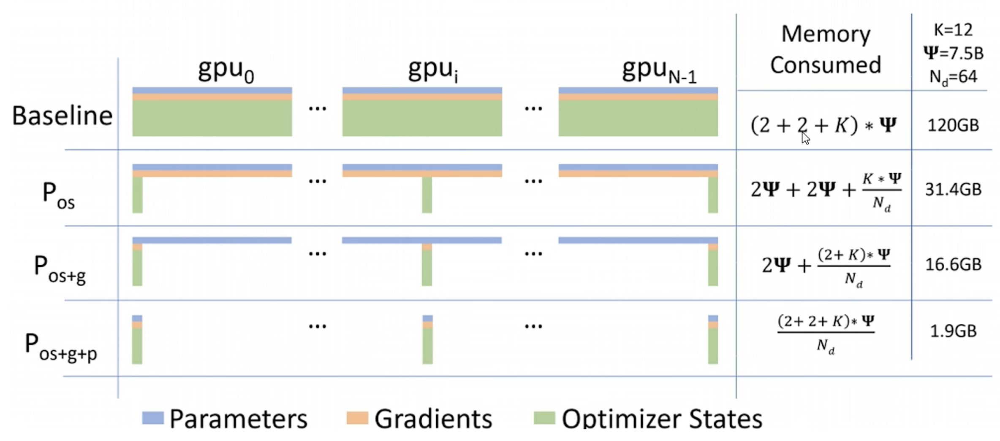

## 大模型分布式训练技术

数据并行、张量并行和流水并行，形成“3D并行”

## 数据并行

### DP

 

### DDP

 

### DeepSpeed Zero

- **Zero-1**

- **Zero-2**

- **Zero-3**

 

## 模型并行

### 张量并行

 

### 流水并行

- **朴素流水线**

- **GPipe**

- **PipeDream**