## LLM微调技术

**Fine-tuning** **(微调)**，是指在新数据集上调整预训练模型的权重，从而提高模型在特定领域，或特定任务上的性能。

我们把模型权重用矩阵表示，全量微调就是优化这个矩阵，让它满足我们下游任务的需求，大模型可能有10亿以上的参数。假设一个模型的参数矩阵 $W_0$，是 1000×1000 维的。

通过微调后，得到新矩阵 $W_{new}$ ， $W_{new}=W_0+ΔW$ ， $ΔW$ 其实就是模型更新的部分。

全量微调，就是要寻找到 1000×1000 维的 ΔW ，也就是100万个参数，这个复杂度是很高的。有哪些方式可以高效的进行微调？ 其中常见的高效方法如下所示。 


### 1. **LoRA**

   LoRA方法的核心思想就是通过低秩分解来模拟参数的改变量，从而以极小的参数量来实现大模型的间接训练。

   ### **原理解释**
   
   在涉及到矩阵相乘的模块，在原始的PLM旁边增加一个新的通路，通过前后两个矩阵A,B相乘，第一个矩阵A负责降维，第二个矩阵B负责升维，中间层维度为r，从而来模拟所谓的本征秩（intrinsic rank）。

   <p align="center">
     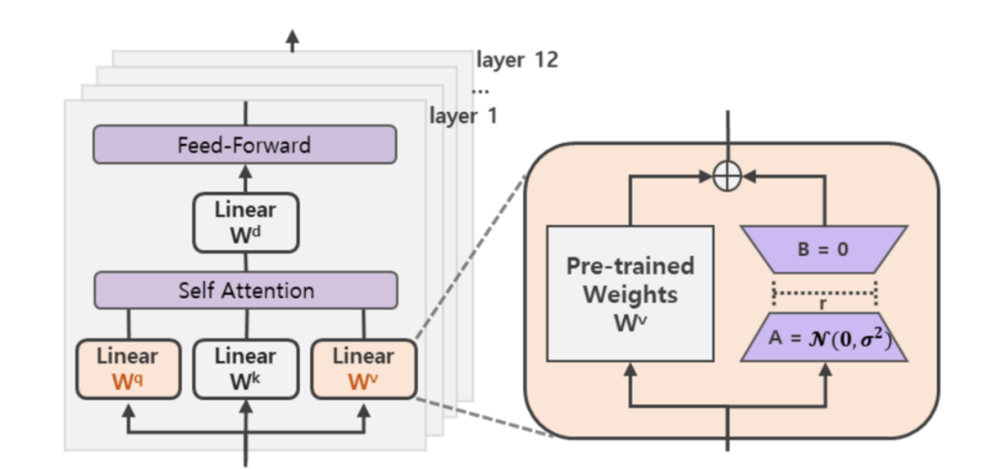
   </p>
   
   可训练层维度和预训练模型层维度一致为d，先将维度d通过全连接层降维至r，再从r通过全连接层映射回d维度，其中，r<<d，r是矩阵的秩，这样矩阵计算就从 d x d 变为 d x r + r x d ，参数量减少很多。

   <p align="center">
     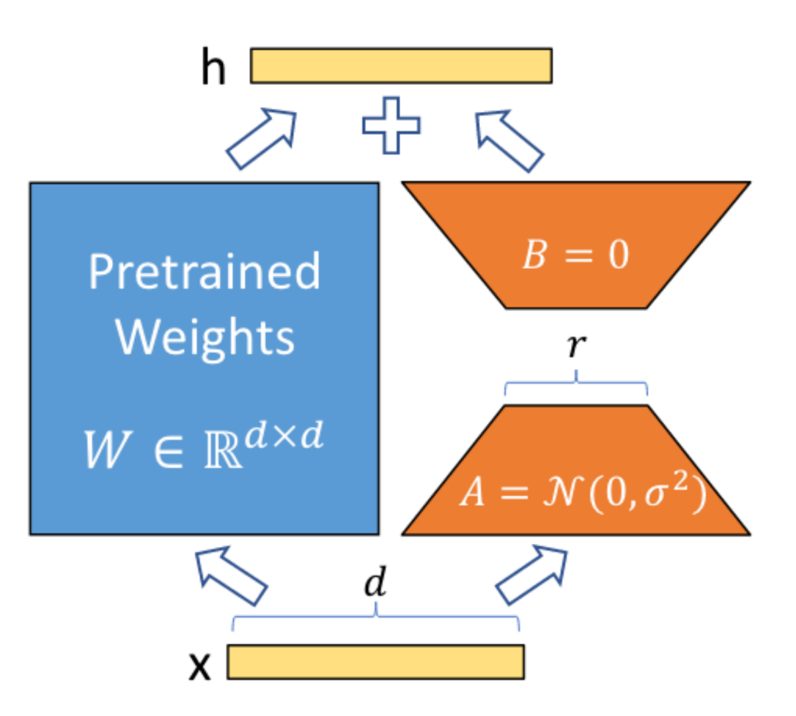
   </p>

   在下游任务训练时，固定模型的其他参数，只优化新增的两个矩阵的权重参数，将PLM跟新增的通路两部分的结果加起来作为最终的结果（两边通路的输入跟输出维度是一致的），即h=WX+BAX。第一个矩阵的A的权重参数会通过高斯函数初始化，而第二个矩阵的B的权重参数则会初始化为零矩阵，这样能保证训练开始时新增的通路BA=0从而对模型结果没有影响。
   
   <p align="center">
     $$h = W_{0}X + ΔWX = W_{0}X + (B A)X$$
   </p>
   
   在推理时，将左右两部分的结果加到一起即可，h=WX+BAX=(W+BA)X，所以只要将训练完成的矩阵乘积BA跟原本的权重矩阵W加到一起作为新权重参数替换原本PLM的W即可，对于推理来说，不会增加额外的计算资源。
   
   此外，Transformer的权重矩阵包括Attention模块里用于计算query, key, value的Wq，Wk，Wv以及多头attention的Wo,以及MLP层的权重矩阵，LoRA只应用于Attention模块中的4种权重矩阵，而且通过消融实验发现同时调整 Wq 和 Wv 会产生最佳结果。
   
   实验还发现，保证权重矩阵的种类的数量比起增加隐藏层维度r更为重要，增加r并不一定能覆盖更加有意义的子空间。

   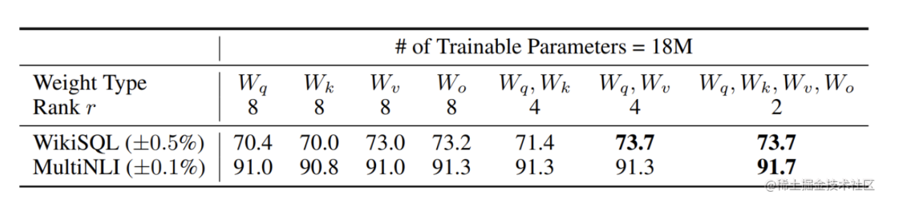

   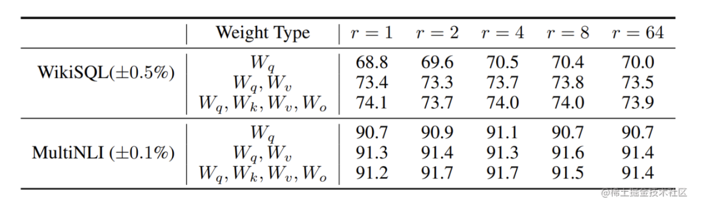

   那么关于秩的选择，通常情况下，rank为4，8，16即可。
   
   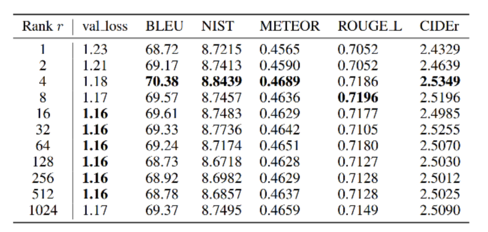

   通过实验也发现，在众多数据集上LoRA在只训练极少量参数的前提下，最终在性能上能和全量微调匹配，甚至在某些任务上优于全量微调。

   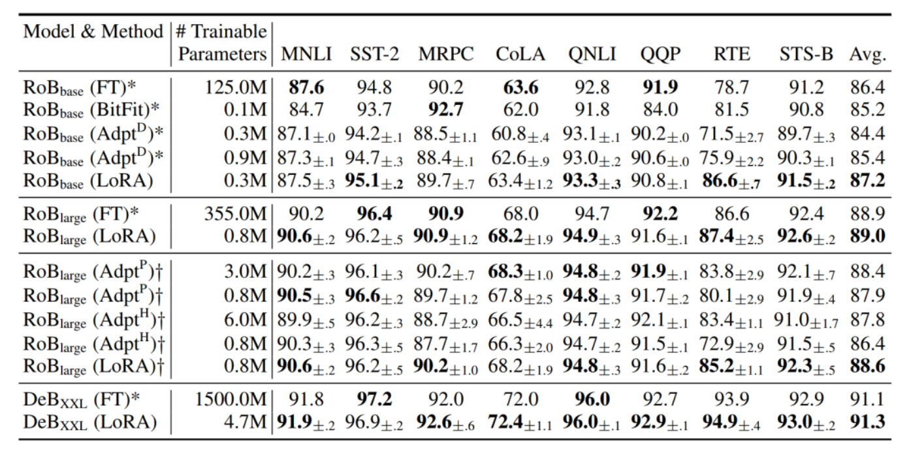

<br>

---
   
### 2. AdaLoRA

   LoRA的一个重要的局限性是在一个模型的所有使用适配器的模块都使用了同一个r，但是无论是不同深度的参数，还是同一个深度不同模块的参数，它们在模型中的重要性都是不同的，不同重要性的模块最好拥有不同的秩。例如图1的这两个例子，作者通过只对特定的模块进行微调，得出了不同参数的重要性的可视化结果。从中我们可以看出，自注意机制的全连接层要比计算Q,K,V的权值重要，而更深的参数要比更浅的参数重要。

   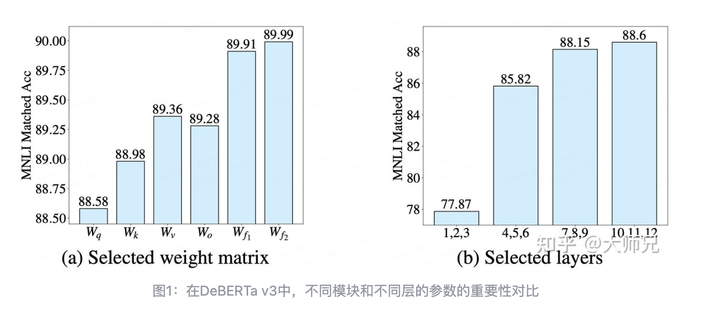

   ### **2.1 背景知识-SVD**

   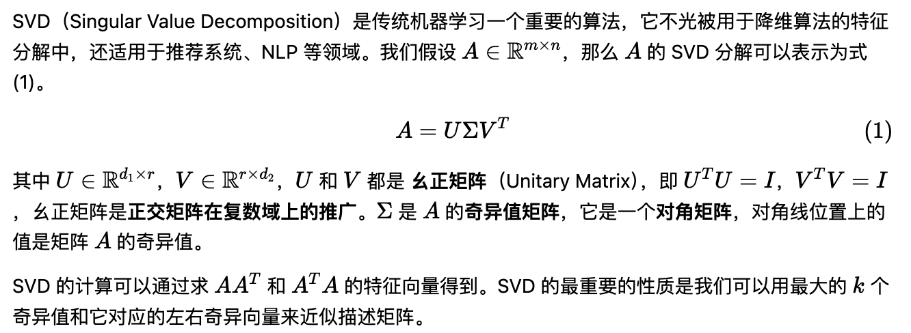

   ### **2.2原理解释**

   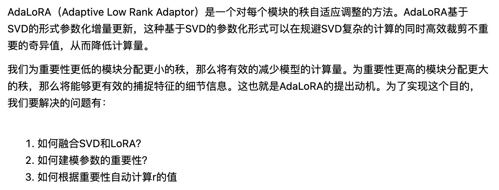


   ### **2.2.1 如何融合SVD和LoRA?**

   <p align="center">
     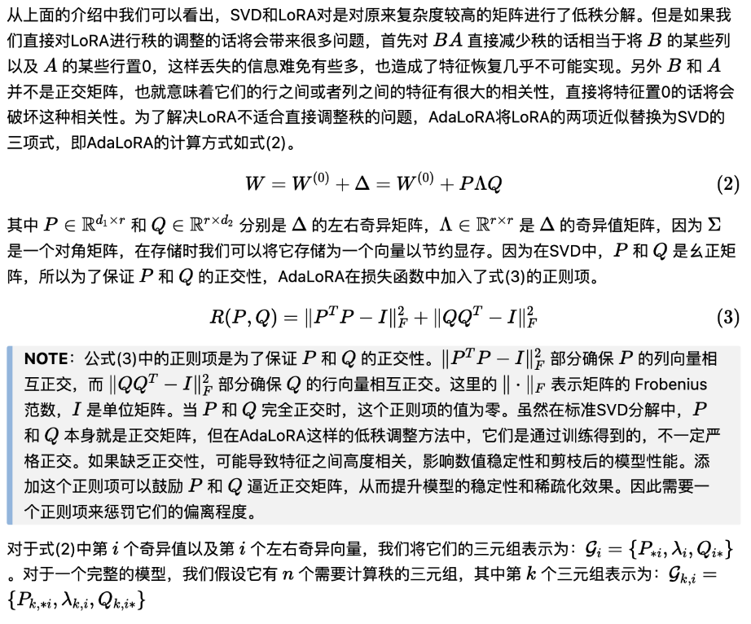
   </p>

   <br>

   ### **2.2.2 如何建模特征的重要性？**

   <p align="center">
     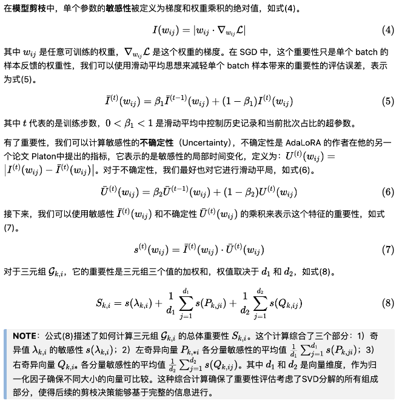
   </p>

   <br>

   ### **2.2.3 如何根据重要性自动计算秩 r 的值？**

   <p align="center">
     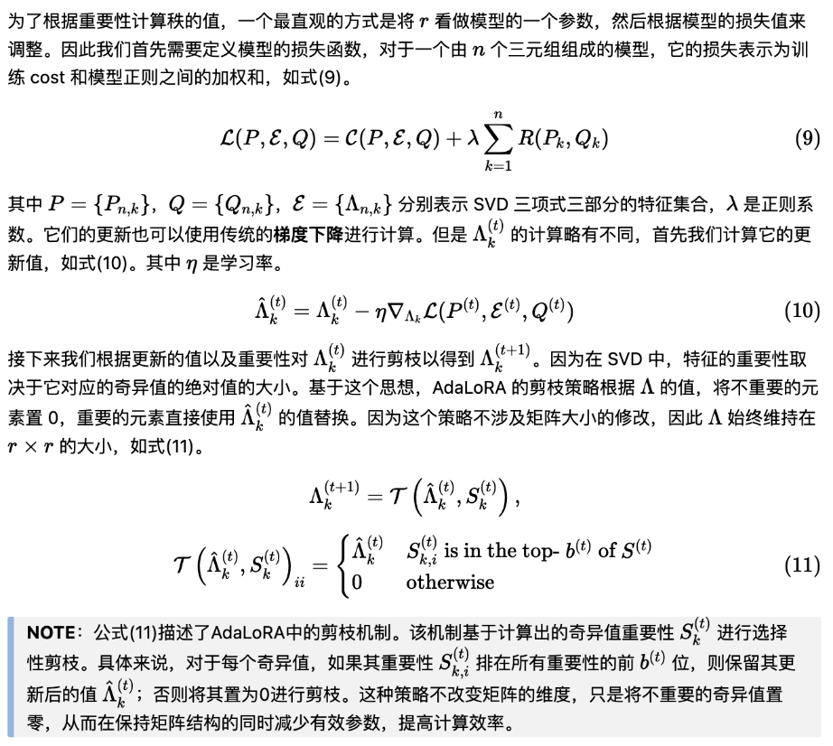
   </p>

   <p align="center">
     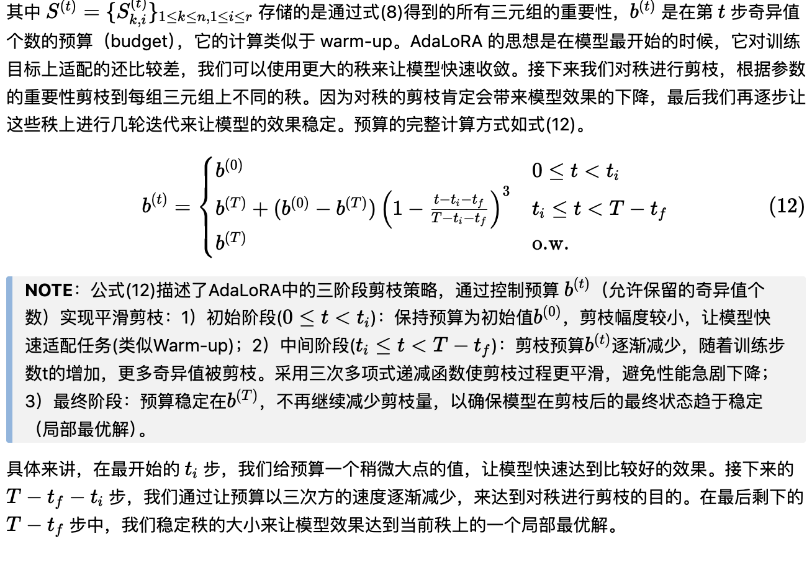
   </p>

   ### **2.2.4 AdaLoRA计算概括**

   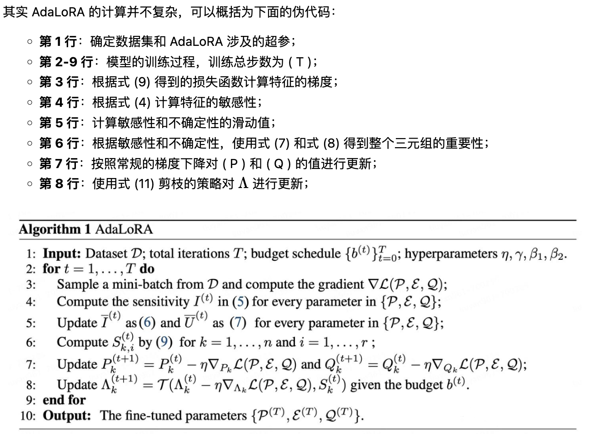

<br>

---

### 3. QLoRA

   ### **3.1 背景知识 - 量化**

   ### **3.1.1 数据格式**

   <p align="center">
     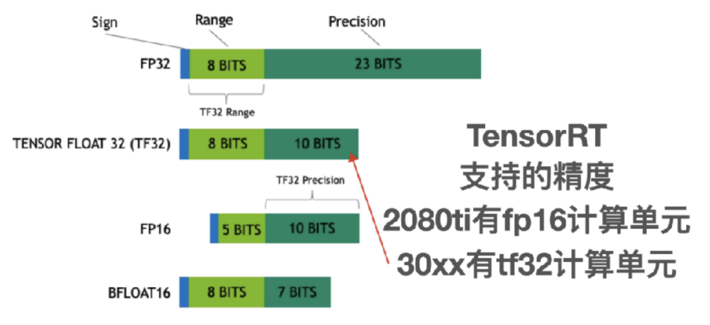
   </p>

  对于**浮点数**来说，指数位（浅绿色部分）表示该精度可达的动态范围，而尾数位（深绿色部分）表示精度。

  - **FP32** 是单精度浮点数，用8bit 表示指数，23bit 表示小数；
  - **FP16**半精度浮点数，用5bit 表示指数，10bit 表示小数；
  - **BF16**和**TF32** 是一种截短的 Float32 数据格式：
  - **BF16**将**FP32** 中 23 个尾数位截短为 7 bits，而指数位仍为 8 bits，总长度为 16 (=1 + 8 + 7) bits
  - **TF32**将 **FP32** 中 23 个尾数位截短为 10 bits，而指数位仍为 8 bits，总长度为 19 (=1 + 8 + 10) bits

  此外，**FP8**是一种8位浮点数据格式，近年来由Nvidia、Arm、Intel等联合推出，用于加速深度学习训练和推理。**FP8**有两种不同的表示形式：**E4M3**和**E5M2**。**E4M3**能表示的精度更高，而**E5M2**能表示的动态范围更大。

  - **E4M3**由1位符号位、4位指数位、3位尾数组成，可以存储高达±448的值以及NaN（非数字）。
  - **E5M2**由1位符号位、5位指数位、2位尾数组成，可以存储最多±57344、±inf（无穷大）和NaN的值。

  对于整数来说，**INT8**是用 8 bits字节表示的整数（无符号：0-255，有符号：-127-128），此外，还有**INT4**等更为激进的量化格式

   ### **3.1.2 定点量化**

   **定点量化**的思路其实就是截断，比如我要计算1.234 * 5.678，那么可以只取一位小数，计算1.2 * 5.6来做近似。

   **定点近似**主要是缩小浮点表示中的指数和小数部分的位宽，不需要额外的量化参数，也没有反量化过程，实现相对简单，但是在数值较大时，直接定点近似会带来较大的精度损失。

   例如Pytorch推理时采用半精度推理（**FP32**--->**FP16**），一般不会带来精度下降，这证明在推理阶段，**FP16**的精度在大部分情况已经足够，只有在输入数据的数值范围很大的情况下有可能会溢出。（**FP32**用于训练主要是为了训练的稳定性，在计算梯度时需要感知到很小的数据变化）

   ### **3.1.3 基于映射的量化 Range Based Approximation**

  **基于范围的近似**，则需要统计待量化数据的分布，然后进行整体的缩放和偏移，再映射到量化空间，精度相对更高，但**需要额外存储量化参数(如缩放系数、偏移等)**，并且**计算时需要先反量化，比定点近似更复杂**。

  例如将**FP32**的权重和输入映射到**INT8**，这也是实际使用比较多的量化算法。

  **据映射方式的不同，又可分为线性映射和非线性映射**：

  - **线性映射**将数值从浮点空间线性变换到量化空间
  - **非线性映射**的变换关系是非线性的

  线性映射并没有考虑原始数据本身的分布，如下图的正态分布，越靠近中间的 0，数据分布越密。

  **左边是线性映射**，量化后数值也同样会集中在中间的 0 附近，如果更极端一点，会导致大量的数值量化后都是 0， 显然这样就降低了量化的精度。

  **右图是非线性映射**，对数据分布密集的区域，给与更多的量化映射，就能增加量化后的差异性，提高精度。

  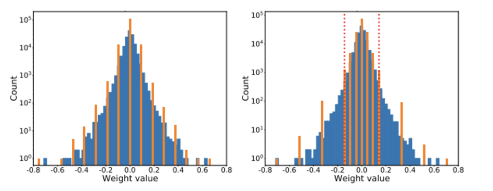

  非线性映射有多种实现，这里介绍一种**分位量化方法**（Quantile Quantization，也是QLoRA中使用的量化方法）：分位量化的基本想法是寻找一些分位点对原数据进行划分，使得各个区间的数据个数相等，然后将同一个区间的数据映射到同一个值，从而实现了量化。


   ### **3.2 原理解释**

   QLoRA是一个使用量化思想对LoRA进行优化的量化算法，可以显著的降低训练大模型时所需要的显存资源。QLoRA的优化有三个核心要点:
   
   1. **定义了一种4位标准浮点数（Normal Float 4-bit，NF4）量化，基于分块的分位数量化的量化策略**

      QLoRA 算法提出的 NF4(4-bit NormalFloat Quantization) 是分位量化的一种实现，其采用 4 bit，总共有16个分位数，并且为了保持 0 映射后仍然是 0 进行了特殊处理，把[-1, 0]分成7份，然后生成[-1, …, 0]共8个分位数, 把[0, 1]分成8份，然后生成[0, …, 1]共9个分位数，两个合起来去掉一个0就生成全部的16个分位数：

      ```
      Q = [-1.0,                 -0.6961928009986877,   -0.5250730514526367,   -0.39491748809814453, 
          -0.28444138169288635,  -0.18477343022823334,  -0.09105003625154495,  0.0, 
          0.07958029955625534,   0.16093020141124725,   0.24611230194568634,   0.33791524171829224, 
          0.44070982933044434,   0.5626170039176941,    0.7229568362236023,    1.0]
      ```

      NF4 量化的16个区间分布如下图，各区间的面积基本相当，整体上也是符合正态分布的：

      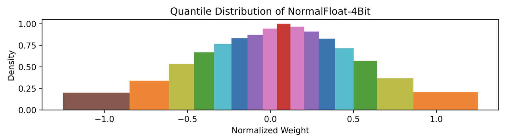

      我们可以通过下面这个例子简单理解QLoRA中4位标准浮点数量化是如何计算的。QLoRA采用的也是分块量化。假设一个张量有16个值，它的被分成了4块：

      ```
      input_blocked_tensor = [
        [-1.28645003578589, -1.817660483275528, 9.889441349505042, 0.010208034676132627],
        [ -15.009014631551885, 1.4136255086268115, -7.815595761491153, 10.766760590950263], 
        [-0.731406153917959, 3.468224595908726, 2.445252541840315, -8.970824523299282], 
        [-9.641638854625175, 7.696158363188889, -5.323939281255154, 5.97160401402024]
      ]
      ```

      根据每个块的特征的绝对值的最大值，我们为每个块保存一个量化常数，它的计算方式是每个块中特征的绝对值中最大的那个：
      
      ```
        c1 = max(|-1.28645003578589|, |-1.817660483275528|, |9.889441349505042|, |0.010208034676132627|) = 9.889441349505042
        c2 = max(|-15.009014631551885|, |1.4136255086268115|, |-7.815595761491153|, |10.766760590950263|) = 15.009014631551885
        c3 = max(|-0.731406153917959|, |3.468224595908726|, |2.445252541840315|, |-8.970824523299282|) = 8.970824523299282
        c4 = max(|-9.641638854625175|, |7.696158363188889|, |-5.323939281255154|, |5.97160401402024|) = 9.641638854625175
      ```

      最后我们便可以计算这个张量的量化值了。例如第一个值 `-1.28645003578589`，它除以这个块的量化常数 $c_{1}$ 后得到 `-0.13008318572517502`，我们可以在 Q 中找到与它最接近的值是 `-0.09105003625154495`，这个值在 Q 中对应的索引是 `6`，因此这个值被量化后的值是 `6`。

      同理，我们可以得到这个输入张量所有的值量化后的结果。在模型保存时，除了要保存量化后的值，我们还要保存每个块对应的量化常数 $c_{i}$，因为这个值在我们进行反量化时需要用到。

      ```
      [[6, 5, 15, 7],
       [0, 8, 2, 14],
       [6, 11, 10, 0],
       [0, 14, 2, 13]]
      ```
      在反量化时，我们以量化结果作为索引，从Q中查找到它对应的分位数，再乘以为每个块保存的量化常数 $c_{i}$ ，便可以得到最终结果。

      ```
      [[-0.9004339933799617, -1.8273060011889755, 9.889441349505042, 0.0],
      [-15.009014631551885, 1.1944218804231184,  -7.880829111886221,  10.850869732860506],
      [-0.816793898052648, 3.0313783372030603, 2.2078302737800004, -8.970824523299282],
      [-9.641638854625175, 6.970488722350373, -5.062564734402345, 5.424549965245643]]
      ```

   2. **双重量化，包含对普通参数的一次量化和对量化常数的再一次量化，可以进一步减小缓存占用**

      在上面我们介绍到，当我们保存模型时我们不仅要保存量化后的结果，还要保存每个块的量化常数。虽然量化后的参数精度只有 **4-bit**，但是这个量化常数的精度是 **float32**。在 **QLoRA** 中，每个块的大小是 **64**，因为块中的每个值占 **4-bit**。这相当于为了存储量化常数，模型要额外占用： $\frac{32}{(64 \times 4)} = 12.5\%$ 的显存。

      QLoRA 的 **双重量化** 就是对这个量化常数 **再做一次 8-bit 的量化**，在进行量化常数的量化时，QLoRA 以 **每 256 个量化常数为一组** 再做一次量化。因此它额外增加的内存消耗有两部分组成：一部分是量化后的8-bit的第一层的量化常数，它额外增加的显存占比是： $\frac{8}{(64 \times 4)} = 3.125\%$ ，第二部分是为量化常数做量化的第二层的32-bit的量化常数，它额外增加的显存占比是： $\frac{32}{(256 \times 64 \times 4)} = 0.049\%$ 。因此，使用双重量化后，额外增加的显存只有 **3.17%**。

      因为使用了双重量化，在进行反量化时，我们也需要 **进行两次反量化**，才能够把量化后的值还原。

   3. **分页优化器（Page Optimizer），用来在显存过高时用一部分内存代替显存**
   
      分页优化是针对梯度检查点做的进一步优化，以防止在显存使用峰值时发生显存OOM的问题。QLoRA分页优化其实就是当显存不足是，将保存的部分梯度检查点转移到CPU内存上，和计算机的内存数据转移到硬盘上的常规内存分页一个道理。

<br>

---

### 4. Prefix Tuning

  前缀微调（Prefix-Tuning）是一种轻量级的微调方法，受提示（Prompting）的启发，它引入了可训练的连续前缀向量，作为任务特定的参数。该方法通过在输入序列前添加一组可训练的前缀向量（prefix），模型在生成时可以将其视为“虚拟的”提示，使得预训练语言模型能够在不修改其原有参数的情况下，适应特定任务。这些前缀向量在模型的每一层中都存在，作为额外的上下文信息引导模型生成符合任务需求的输出。

   <p align="center">
     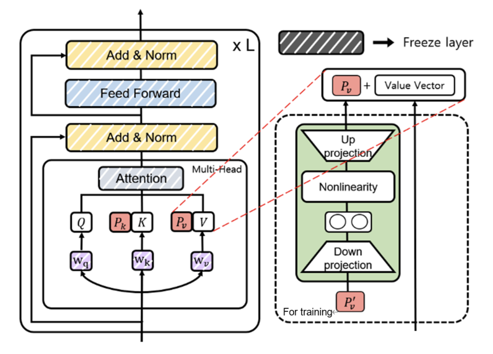
   </p>

  ### 4.1 **前缀向量的构建与作用**
  **前缀向量的定义：**
  - 前缀长度（L）：指前缀中向量的数量。前缀长度通常`远小于输入序列的实际长度`。
  - 前缀维度（d）：每个前缀向量的维度，通常`与模型的隐藏层维度一致`。

  **前缀向量的构建：**
  - 前缀向量不是基于特定词汇的嵌入，而是由`独立的可训练参数`构成。
  - `对于每一层 Transformer 模型，都会有独立的一组前缀向量`，这些向量会被注入到对应的层中。

  **前缀向量的作用：**
  - 前缀向量作为额外的上下文信息，与输入序列共同通过模型的注意力机制进行处理。
  - 它们能够`调节注意力分布，影响模型对输入的理解和生成`，进而适应特定任务。

  ### 4.2 **前缀向量在 Transformer 中的集成方式**

  `Prefix-Tuning` 的核心思想是在每一层 Transformer 的自注意力机制中引入一组可训练的前缀向量，这些前缀向量作为额外的键和值，影响注意力的分布，从而引导模型适应特定任务。

  **注入位置：**
  - 前缀向量通常`注入到每一层的自注意力子层的键（Key）和值（Value）部分`。
  - 在自注意力机制中，查询（Query）、键（Key）和值（Value）是从输入向量通过线性变换得到的。

  **注意力计算的调整：**
  - 将前缀向量作为额外的键和值，`与原始输入的键和值进行拼接`。
  - 具体来说，对于每一层，前缀向量被视为虚拟的上下文信息，与实际的输入序列一起参与注意力计算。

  **具体操作步骤：**
  - **输入处理**：
  对于输入序列 $X = [x_1, x_2, \dots, x_n]$，每个 $x_i$ 经过嵌入层得到嵌入向量 $E(x_i)$。

  - **前缀注入**：
  为每一层 $l$，引入前缀向量 $P^l = [p_1^l, p_2^l, \dots, p_L^l]$，其中 $L$ 是前缀长度。

  - **自注意力机制调整**：
  在第 $l$ 层的自注意力计算中：
   
    $Q = X W_Q$

    $K = [P^l; X] W_K$

    $V = [P^l; X] W_V$

    $\text{Attention}(Q, K, V) = \text{softmax} \left( \frac{Q K^T}{\sqrt{d_k}} \right) V$

    其中， $W_Q$, $W_K$, $W_V$ 是查询、键和值的线性变换矩阵， $d_k$ 是键向量的维度。

  - **隐藏状态更新**：
  经过注意力机制后，隐藏状态 $H^l$ 被更新，并传递到下一层。


  **参数量分析：**

  假设模型有 L 层，每层前缀长度为 P ，嵌入维度为 d ，则总的前缀参数量为: $\text{Total Parameters} = L \times P \times d$

  相比于全模型微调所需的庞大参数量，Prefix-Tuning 显著减少了需要优化的参数数量。

  ### **4.3 前缀向量的优化与训练**

  **参数优化：**
  - 冻结原模型参数：在微调过程中，预训练模型的所有参数保持不变，仅优化前缀向量 $P^l$的参数。通过设置模型的其他参数 $W_Q$, $W_K$, $W_V$, $W_O$ 等为冻结状态（即 `requires_grad = False`），确保在训练过程中这些参数不会被更新。

  - 训练目标：根据具体任务（如分类、生成等），定义相应的损失函数，通过反向传播仅更新前缀向量。

  **训练流程：**
  1. **初始化：** 前缀向量 $P^l$ 通常随机初始化，或基于预训练模型的某些特征进行初始化。

  2. **前向传播：** 输入序列与前缀向量共同通过模型进行前向传播，生成输出。

  3. **计算损失**：根据任务定义计算损失（如交叉熵损失）。

  4. **反向传播**：仅更新前缀向量 $P^l$ 的参数，保持模型其他参数不变。

  5. **迭代优化**：重复前向传播和反向传播，直至收敛或达到预设的训练轮数。


### 应用场景

  Prefix Tuning 特别适用于需要捕捉复杂上下文信息的任务，例如：

  - 生成式任务：如文本生成、对话生成等。

  - 问答系统：根据上下文生成回答。

  
<br>

---

### 5. Prompt Tuning

`Prompt Tuning`，该方法可以看作是`Prefix Tuning`的简化版本，它给每个任务定义了自己的Prompt，然后拼接到数据上作为输入，但只在输入层加入prompt tokens，并且不需要加入 MLP 进行调整来解决难训练的问题。

`Prompt Tuning` 通过反向传播更新参数来学习prompts，而不是人工设计prompts；同时冻结模型原始权重，只训练prompts参数，训练完以后，用同一个模型可以做多任务推理。

**例子讲解**

例1：想象你是一家通用快递公司的快递员，你能够处理各种包裹。然而，现在你有一些特殊的包裹需要额外处理，比如易碎品。在 Prompt Tuning 中，相当于你在每个易碎品包裹前面加上一个特别的标签，比如“易碎”，以提醒你在处理这些包裹时要更加小心。例如，原始包裹信息是：“Package contains glassware”（包裹内含玻璃制品）。在 Prompt Tuning 中，你会在包裹信息前加上“易碎”标签，让信息变成：“Fragile: Package contains glassware”。这些“Fragile”标签是可训练的，通过训练这些标签，你可以更好地处理易碎品。

例2：假设你有一个已经训练好的模型，能够回答通用问题。现在你希望它能够更好地回答旅游相关的问题。原始输入句子是：“What is the best place to visit in summer?”（夏天最好的旅游地点是哪里？）。在 Prompt Tuning 中，你会在输入句子前添加一些额外的 Token，比如 [TRAVEL]，让输入变成：[TRAVEL] What is the best place to visit in summer? 这些 [TRAVEL] Token 是可训练的，通过训练这些 Token，你可以让模型更好地理解这是一个关于旅游的问题。

**原理解释**

`Model Tuning` 需要为每个下游任务创建一个特定任务的完整预训练模型的副本，并且推理必须在单独的批次中执行。

`Prompt tuning` 仅需要为每个任务存储一个小的特定任务提示，并且可以使用原始的预训练模型进行多任务推理。

对于一个 T5 “XXL” 模型，每个经过微调的模型副本需要 110 亿个参数。相比之下，如果采用提示微调（Prompt Tuning），每个任务仅需存储 20,480 个参数，相比完整微调，参数量减少了五个数量级，假设提示的长度为 5 个 token。

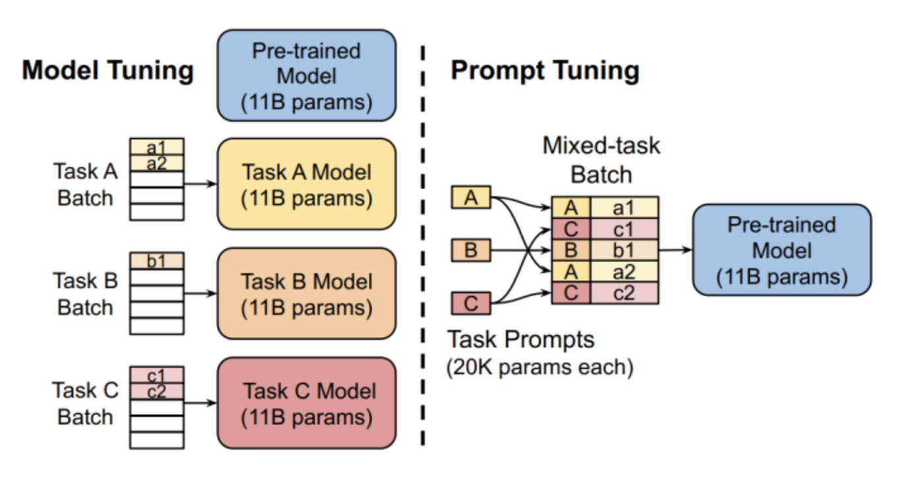

通过实验发现，随着预训练模型参数量的增加，`Prompt Tuning`的方法会逼近全参数微调的结果。

<p align="center">
  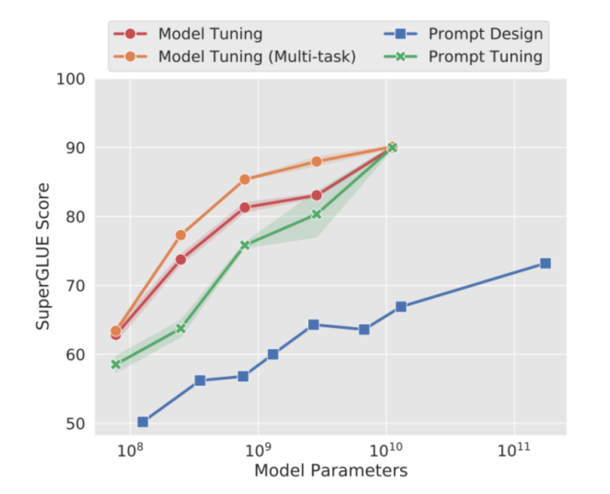
</p>

同时，Prompt Tuning 还提出了 Prompt Ensembling，也就是在一个批次（Batch）里同时训练同一个任务的不同 prompt（即采用多种不同方式询问同一个问题），这样相当于训练了不同模型，比模型集成的成本小多了。

<p align="center">
  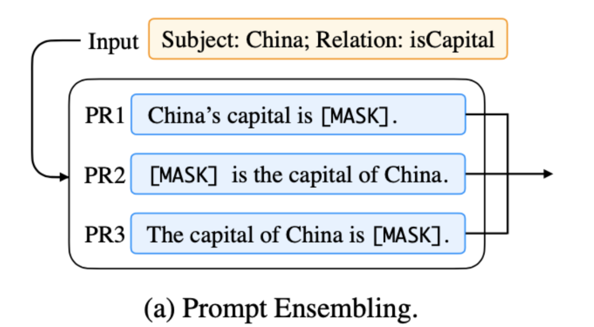
</p>

除此之外，Prompt Tuning 论文中还探讨了 Prompt token 的初始化方法和长度对于模型性能的影响。通过消融实验结果发现，与随机初始化和使用样本词汇表初始化相比，Prompt Tuning采用类标签初始化模型的效果更好。不过随着模型参数规模的提升，这种gap最终会消失。

Prompt token 的长度在20左右时的表现已经不错（超过20之后，提升Prompt token长度，对模型的性能提升不明显了），同样的，这个gap也会随着模型参数规模的提升而减小（即对于超大规模模型而言，即使 Prompt token 长度很短，对性能也不会有太大的影响）。

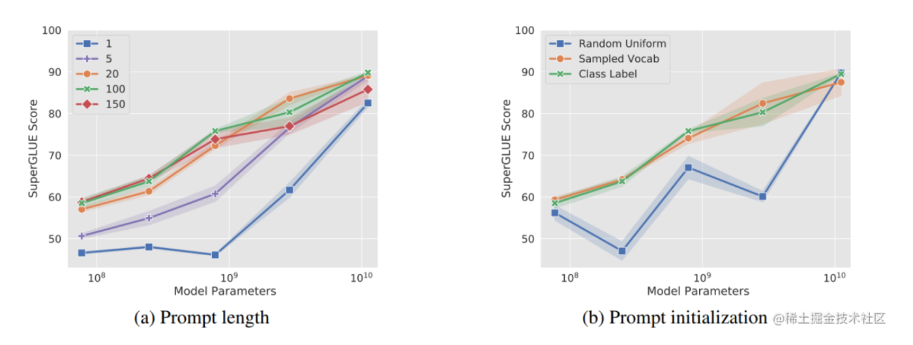

**应用场景**

Prompt Tuning 特别适用于任务复杂度较低或数据量较少的下游任务例如：

- 文本分类：判断邮件是否为垃圾邮件。

- 情感分析：分析社交媒体上的评论是正面还是负面。

<br>

---

### 6. P-Tuning

`P-Tuning` 是 `Prompt Tuning` 的一种变体，其核心思想是在特定位置插入可训练的 Token，使模型能够更好地理解下游任务的需求。`P-Tuning` 方法通过在输入序列中间插入额外的 Prompt Token，使模型在处理输入时能更好地捕捉上下文信息。

**例子讲解**

例1：想象你是一名快递员，你的任务是将包裹准确无误地送达目的地。现在，你需要处理一些特殊包裹，这些包裹需要在中途添加一些额外的处理步骤。在 P-Tuning 中，相当于你在配送过程中间的某个环节插入一些额外的处理步骤，比如“重新包装”或“安全检查”，以确保这些包裹能够安全送达。例如，原始包裹信息是：“Deliver package to address A”（将包裹送到地址A）。在 P-Tuning 中，你会在中途插入一些额外的处理步骤，让信息变成：“Deliver package to address A, stop for security check, then continue to address A”。这些额外的处理步骤是可训练的，通过训练这些步骤，你可以更好地处理特殊包裹。

例2：假设你有一个已经训练好的模型，可以生成文章。现在你希望它能够生成关于科技的文章。原始输入句子是：“Artificial intelligence is transforming the world.”（人工智能正在改变世界。）在 P-Tuning 中，你会在输入序列中间插入一些 Token，比如 [TECH]，让输入变成：“Artificial intelligence [TECH] is transforming the world.” 这些 [TECH] Token 是可训练的，通过训练这些 Token，你可以让模型更好地理解这是一个关于科技的文章。

**原理解释**

P-Tuning，该方法将Prompt转换为可以学习的Embedding层，并用MLP+LSTM的方式来对Prompt Embedding进行一层处理。

下图是一个关于提示搜索的示例："The capital of Britain is [MASK]"。

给定 上下文（the context）（蓝色区域，“Britain”）和 目标（target）（红色区域，“[MASK]”），橙色区域表示 提示标记（prompt tokens）。

在 (a) 中，提示生成器仅接收 离散奖励（discrete rewards）；而在 (b) 中，伪提示和 提示编码器（prompt encoder） 可以以 可微分的方式（a differentiable way） 进行优化。有时，在 (b) 中添加一些与任务相关的锚点 token（例如“capital”）可以带来进一步的改进。

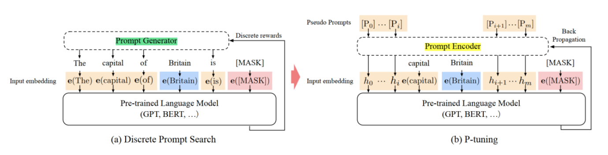

相比Prefix Tuning，P-Tuning加入的可微的virtual token，但仅限于输入层，没有在每一层都加；另外，virtual token的位置也不一定是前缀，插入的位置是可选的。这里的出发点实际是把传统人工设计模版中的真实token替换成可微的virtual token。

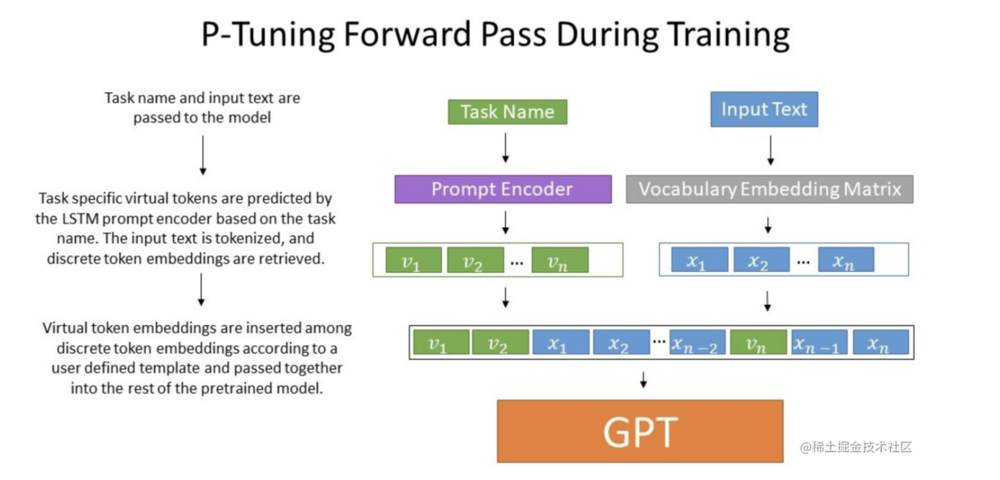

经过预训练的LM的词嵌入已经变得高度离散，如果随机初始化virtual token，容易优化到局部最优值，而这些virtual token理论是应该有相关关联的。因此，作者通过实验发现用一个prompt encoder来编码会收敛更快，效果更好。即用一个LSTM+MLP去编码这些virtual token以后，再输入到模型。

从对比实验证实看出，P-Tuning获得了与全参数一致的效果。甚至在某些任务上优于全参数微调。

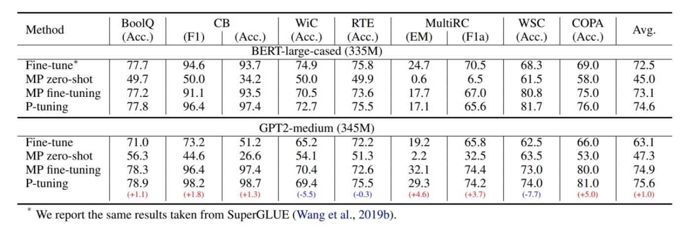

并且在实验中还发现，相同参数规模，如果进行全参数微调，Bert的在NLU任务上的效果，超过GPT很多；但是在P-Tuning下，GPT可以取得超越Bert的效果。

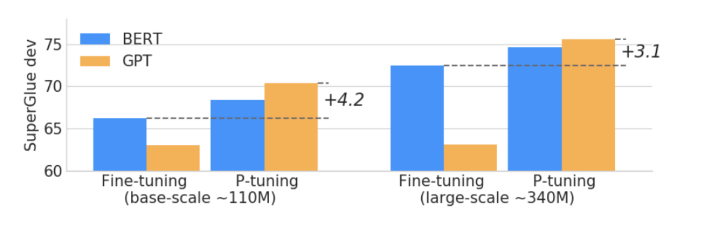


**应用场景**

P-Tuning 适用于各种下游任务，特别是那些需要在输入序列中捕捉特定位置信息的任务，例如：

- 序列标注：如命名实体识别、词性标注等。

- 文本生成：如自动摘要、对话系统等。